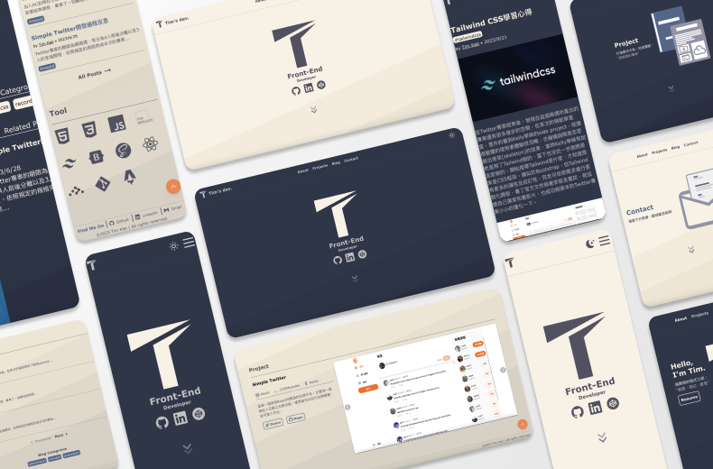

# Personal Web

這是我的個人網站，使用Astro搭配Tailwind CSS所打造，歡迎瀏覽。


Link:https://timkao-dev.netlify.app/
## 執行專案
1. 打開終端機執行以下程序：
```
git clone https://github.com/Tim0124/Personal.git
```
2. 切換至當前資料夾，安裝套件
```
npm install
```
3. 啟動專案
```
npm run dev
```
4. 退出專案
```
control + c
```

## 建置環境
* Node 18.18.0

* Astro 2.10.3

* React: 18.2.0

* Tailwind CSS: 3.3.3

* emailjs: 3.2.0